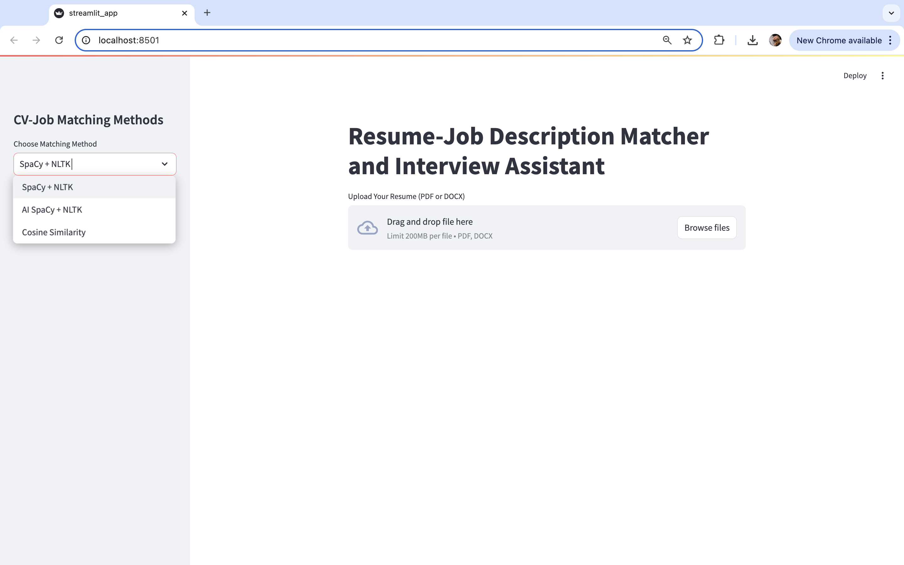
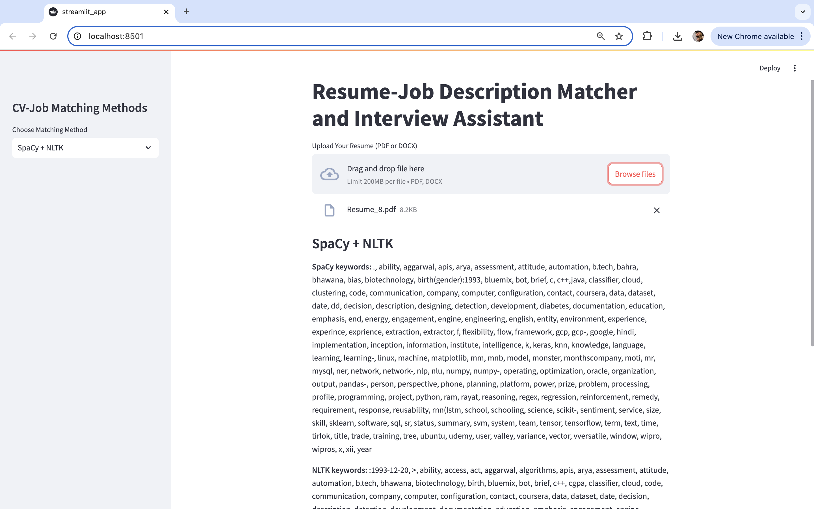
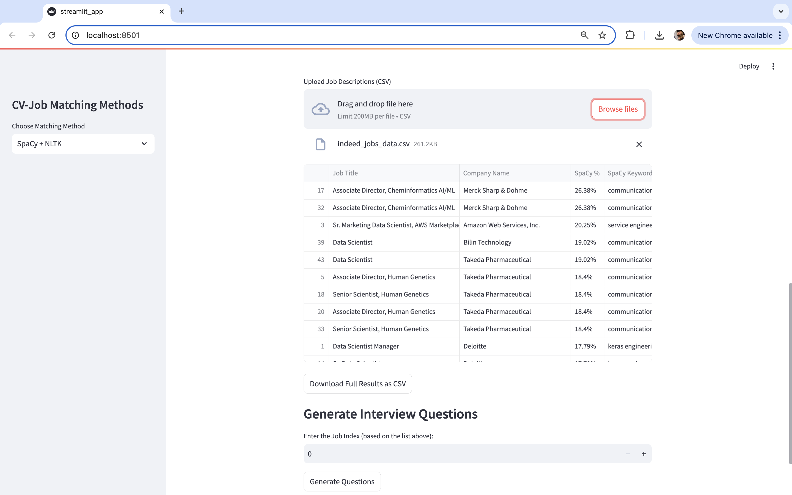
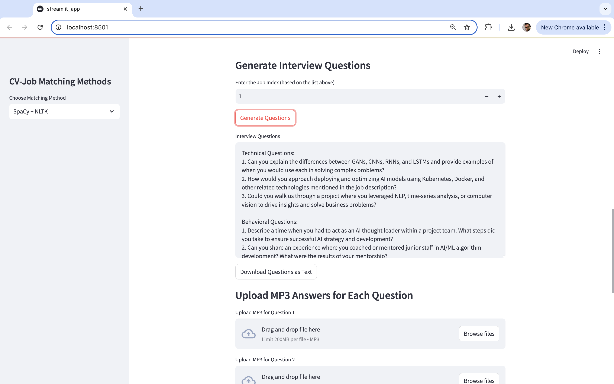
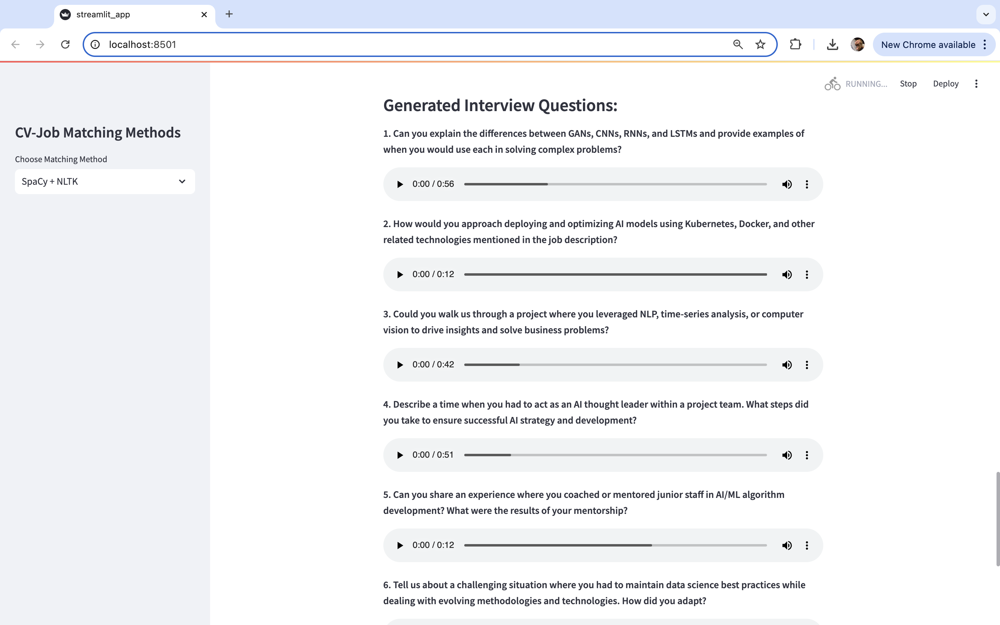
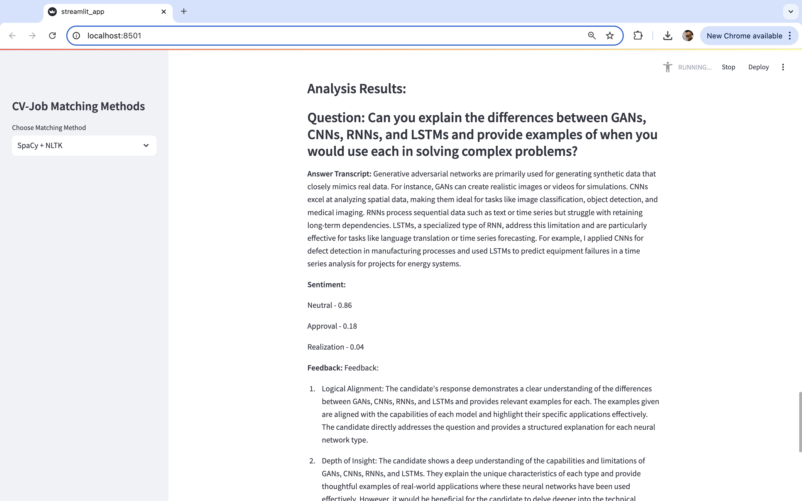

# JobApplicationAssistant
This project allows the user to:
- Scrape job listings from Indeed.com based on a specified job title and location;
- Match a CV with the scraped job listings using cosine similarity or natural language processing (NLP) techniques, such as SpaCy, NLTK, or AI-based keyword extraction methods, to find the most suitable job listing;
- Generate interview questions tailored to the selected job listing;
- Prepare for the job interview by analyzing the user’s audio responses to the interview questions, providing detailed feedback and sentiment analysis.

<br>

## Project Structure

<br>

### `README.md`:
Contains the outline of the project including the files decription and running instructions.
### `requirements.txt`:
Contains the Python libraries and their versions required to run the project.
### `data`:
Contains folders with data.
- `interview_answers`: A folder containing MP3 files with the user's answers to interview questions.
- `resumes`: A folder containing PDF or Word files with CVs in various fields.
### `src`:
Contains source code files.
- `creds.py`: Contains user API keys. The OpenAI API key is stored in the `openai_api_key = ''` format.
- `indeed_scraper`: Contains files for scraping job listings from Indeed.com.
    - `indeed.py`: Defines an asynchronous web scraper for Indeed.com that uses the Scrapfly API.
    - `pyproject.toml`: Specifies project metadata, dependencies, and configurations.
    - `poetry.lock`: Records exact package versions and dependencies (generated by Poetry, dependency and package manager for Python projects).
    - `run.py`: Scrapes job data for a specified position job title and location and saves results to the `./results/` directory.
    - `results`: Contains the output of the Indeed.com job data scraping.
        - `search.json`: Stores raw search results data from Indeed.com.
        - `job_keys.json`: Stores job keys for the top 50 job postings.
        - `jobs.json`: Stores detailed job information for the retrieved listings.
- `job_description_parser.py`: Processes job listing data from JSON files and stores cleaned information in `output/indeed_jobs_data.csv`.
- `nltk_spacy.py`: Extracts keywords from text using NLTK and SpaCy based on noun tags.
- `cv_job_matcher_spacy_nltk.py`: Matches resume with job descriptions using keyword matching (via SpaCy and NLTK), outputting results to `output/similarity_results_spacy_nltk.csv`.
- `cv_job_matcher_openai.py`: Matches resume with job descriptions using keyword matching (via SpaCy and NLTK for job descriptions and OpenAI API for resume), outputting results to `output/similarity_results_openai.csv`.
- `cv_job_matcher_cosine_similarity.py`: Matches resume with job descriptions using cosine similarity, outputting results to `output/similarity_results_cosine_similarity.csv`.
- `interview_questions_generator.py`: Generates tailored interview questions using OpenAI's API based on the top-ranked job description, outputting results to `output/generated_interview_questions.csv`.
- `interview_answers_analysis.py`: Analyzes audio answers using speech recognition, sentiment analysis, and OpenAI API-based feedback generation, outputting results to `output/interview_analysis_results.csv`.
- `streamlit_app.py`: A Streamlit-based web app for resume-job description matching and interview preparation.
### `output`:
Contains project output files.
- `generated_interview_questions.csv`: Contains generated interview questions for the top-matched job position.
- `indeed_jobs_data.csv`: Contains parsed information on job listings for the specified position and location from Indeed.com.
- `similarity_results_spacy_nltk.csv`: Contains matched resume and job listings based on keyword matching (via SpaCy and NLTK). The results are ranked, highlighting the most matching resume and job positions.
- `similarity_results_openai.csv`: Contains matched resume and job listings based on keyword matching, with resume keywords extracted using OpenAI's API and job description keywords extracted using SpaCy and NLTK. The results are ranked, highlighting the most matching resume and job positions.
- `similarity_results_cosine_similarity.csv`: Contains matched resume and job listings based on cosine similarity. The results are ranked, highlighting the most matching resume and job positions.
- `interview_analysis_results.csv`: Contains analyzed audio answers using speech recognition, sentiment analysis, and OpenAI API-based feedback generation.

<br>

## Running instructions
The full code is explained in each .py file in the comments.

### Environment preparation instructions:
1. Create and activate a virtual environment (conda environment was used for the project):
```bash
   conda create --name your_env_name python=3.11
   conda activate your_env_name
```
2. With the virtual environment activated, install the necessary packages specified in `requirements.txt`:
```bash
   pip install -r requirements.txt
```
3. Download spaCy’s English Language Model:
```bash
   python -m spacy download en_core_web_sm
```

### Job scraping instructions:
1. To scrap data from Indeed.com we use **scrapfly.io**. The scraping code is located in the `src/indeed_scraper/indeed.py` file.
2. Retrieve your Scrapfly API key from **https://scrapfly.io/dashboard** and set **SCRAPFLY_KEY** environment variable:
```bash
   export SCRAPFLY_KEY="YOUR SCRAPFLY KEY"
```
3. Install Python environment:
```bash
   cd src/indeed_scraper
   poetry install
```
4. The scraper scraps job listings based on the position title and lcoation. By default, the scraper uses the search parameters: `data scientist` & `Boston`. To modify these parameters, overwrite the existing values in `query={}` and `location={}`. Run scraper using:
```bash
   poetry run python run.py
```
5. The results are saved to the `src/indeed_scraper/results` directory.

### Job description parsing instructions:
The job description parsing script processes the scraped JSON files stored in `src/indeed_scraper/results` and extracts relevant job information.
1. Run the code using:
 ```bash
    pyhton src/job_description_parser.py
```
2. The results are saved to the `output/indeed_jobs_data.csv`.

### CV and job matcher instructions:
CV and job matching is performed using cosine similarity and two methods for keyword extraction from the user's CV.
1. **Method 1: Using SpaCy and NLTK**
    - Modify the `resume_path` variable in the `src/cv_job_matcher_spacy_nltk.py` file to point to the user's resume.
    - Run the code to match the CV with job descriptions based on keyword overlap (using SpaCy and NLTK for both CV and job descriptions) using:
    ```bash
        pyhton src/cv_job_matcher_spacy_nltk.py
    ```
    - The results are saved to the `output/similarity_results_spacy_nltk.csv`.
2. **Method 2: Using OpenAI API**
    - Add your OpenAI API key to the `creds.py` file:
     ```bash
        openai_api_key = "YOUR OPENAI KEY"
    ```
    - Modify the `resume_path` variable in the `src/cv_job_matcher_openai.py` file to point to the user's resume.
    - Run the code to match the CV with the job descriptions based on keyword overlap (using SpaCy and NLTK for job descriptions, OpenAI's API for CV) using:
    ```bash
        pyhton src/cv_job_matcher_openai.py
    ```  
    - The results are saved to the `output/similarity_results_openai.csv`.
3. **Cosine Similarity**
    - Modify the `resume_path` variable in the `src/cv_job_matcher_cosine_similarity.py` file to point to the user's resume.
    - Run the code to match the CV with job descriptions based on cosine similarity using:
    ```bash
        pyhton src/cv_job_matcher_cosine_similarity.py
    ```
    - The results are saved to the `output/similarity_cosine_similarity.csv`.

### Interview questions generation instructions:
The interview questions generation script uses OpenAI's API to generate tailored interview questions based on the job description.
1. Add your OpenAI API key to the `creds.py` file:
```bash
   openai_api_key = "YOUR OPENAI KEY"
```
2. Choose the CV and job matching method (SpaCy/NLTK, OpenAI or cosine similarity) and set the `job_description` variable path to either `output/similarity_results_spacy_nltk.csv`, `output/similarity_results_openai.csv` or `output/similarity_cosine_similarity.csv`. The script will extract the job description from the first row of the file (the top matching job).
3. Run the code using:
 ```bash
    pyhton src/interview_questions_generator.py
```
4. The results are saved to the `output/generated_interview_questions.csv`.

### Interview answers analysis instructions:
The interview answers analysis script evaluates audio responses to interview questions, analyzing their content, sentiment, and relevance to the job description.
1. Add your OpenAI API key to the `creds.py` file:
```bash
   openai_api_key = "YOUR OPENAI KEY"
```
2. Choose the CV and job matching method (SpaCy/NLTK, OpenAI or cosine similarity) and set the `job_description` variable path to either `output/similarity_results_spacy_nltk.csv`, `output/similarity_results_openai.csv` or `output/similarity_cosine_similarity.csv`. The script will extract the job description from the first row of the file (the top matching job).
3. Ensure the audio files for candidate responses are stored in the `data/interview_answers` directory. The file names must follow the format: `answer1.mp3`, `answer2.mp3`, ..., `answer{n}.mp3`.
4. Run the code using:
 ```bash
    pyhton src/interview_answers_analysis.py
```
5. The results are saved to the `output/interview_analysis_results.csv`.

### Streamlit application instructions:
The Streamlit application allows users to match resumes to job descriptions and analyze interview responses through a web interface using the same logic as specified above.
1. Add your OpenAI API key to the `creds.py` file:
```bash
   openai_api_key = "YOUR OPENAI KEY"
```
2. Run the code using:
 ```bash
    streamlit run src/streamlit_app.py
```
3. The application will automatically open in the browser. Follow the instructions on the web page to proceed.
- The initial page look like this:

- The user then selects the CV-Job matching method and uploads a CV for analysis. The output for the SpaCy + NLTK looks like the following:

- The user then uploads the scraped job listings file for analysis. The output looks like this and contain ranked and sorted job listings:

- The user then chooses the job index for interview questions generation. The output looks like this:

- The user then uploads answers to the generated interview questions as mp3 files:

- The program then analyzes the uploaded answers and generates the feedback:


<br>

## Built With
- Python 3.11

<br>

## Python Libraries Used
- loguru==0.7.2 - logging utility that helps in monitoring the status and flow of scraping operations
- nltk==3.9.1 - NLP library for text processing and analysis
- openai==0.28.0 - OpenAI API client for accessing GPT models
- openai_whisper==20240930 - a wrapper for using the Whisper model through the OpenAI API, enabling cloud-based processing and integration with OpenAI’s infrastructure
- optimum==1.23.3 - optimized tools for transformer models (for Hugging Face integration)
- pandas==2.2.3 - data manipulation and analysis, especially for tabular data
- scikit_learn==1.3.0 - ML tools, used for feature extraction and calculating cosine similarity
- scrapfly_sdk==0.8.19 - SDK for scraping websites using Scrapfly service
- spacy==3.7.2 - NLP library for text processing and analysis
- streamlit==1.40.0 - library for creating UI
- textract==1.6.3 - extract text from various document formats (PDF, DOCX, etc.)
- transformers==4.45.2 - Hugging Face library for transformer-based models (RoBERTa)
- whisper==1.1.10 - package for a local implementation of OpenAI's Whisper model for speech recognition